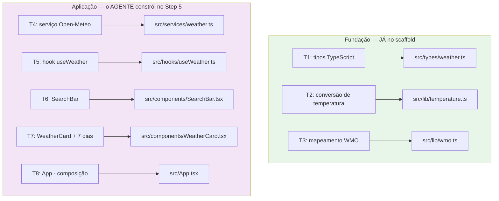

## Step 4: Tasks — Do Plano às Unidades Verificáveis

> O plano técnico está pronto. Agora quebramos o trabalho em **tasks pequenas e verificáveis** — o menor incremento entre o plano e o código. No próximo step, o agente vai **construir o app inteiro** a partir dessas tasks.

### Conceito

Tasks quebram o plano em unidades pequenas o suficiente para serem implementadas e verificadas isoladamente. Cada task aponta para o critério de aceite ou item do plano que ela satisfaz — assim o código nasce como consequência de uma task, não como ponto de partida. Uma boa task tem escopo definido, critério de "feito" objetivo e cabe em poucas horas.

Repare na divisão abaixo: a **fundação** (tipos + funções puras) já veio pronta no scaffold — é o contrato tipado e testável sobre o qual o app é construído. Tudo o mais (serviço de rede, hook, componentes e composição) é o que o **agente vai construir no Step 5**, guiado por estas tasks.



> [!TIP]
> Uma boa task tem: escopo definido, critério de "feito" objetivo e é implementável em < 2 horas. Se demorar mais, quebre em subtasks.

### Objetivo

Registrar as tasks que rastreiam a spec e o plano em um arquivo versionado. O workflow valida apenas que o arquivo de tasks existe — a construção e o build ficam para o Step 5. O objetivo aqui é ter cada task ligada a um `CA` ou item do plano, deixando claro o que já é fundação (T1–T3) e o que o agente vai construir (T4–T8), incluindo a **F5 (previsão de 7 dias)**.

### Mãos à obra: Crie o arquivo de tasks

Cada task abaixo cita o que rastreia (um `CA` da spec ou um item do plano). É esse elo que permite, no review, provar que nada foi implementado "por fora" da spec.

1. Crie a pasta `tasks/`.
2. Crie o arquivo `tasks/weather-app-tasks.md`:

   ```markdown
   # Tasks: Weather App

   ## Sprint 1 — Fundação (JÁ ENTREGUE no scaffold)

   Estas tasks já vêm prontas e testadas no repositório. Servem como contrato
   tipado e como base de funções puras sobre a qual o app é construído.

   ### T1 — Definir tipos TypeScript ✅
   - **Arquivo**: `src/types/weather.ts`
   - **Critério de feito**: interfaces `Location`, `WeatherData`, `AsyncState<T>` e type `WmoCode` exportadas e compilando
   - **Rastreia**: Modelo de dados do plano técnico

   ### T2 — Funções puras de temperatura ✅
   - **Arquivo**: `src/lib/temperature.ts` (+ `temperature.test.ts`)
   - **Critério de feito**: `celsiusToFahrenheit(0) === 32`, `celsiusToFahrenheit(100) === 212`, testes passando
   - **Rastreia**: CA3.1, CA3.2, CA3.3, CA3.4

   ### T3 — Mapeamento WMO ✅
   - **Arquivo**: `src/lib/wmo.ts` (+ `wmo.test.ts`)
   - **Critério de feito**: `getWmoDescription(0) === "Céu limpo"`, `getWmoEmoji(95) === "⛈️"`, fallback para códigos desconhecidos
   - **Rastreia**: CA4.1, CA4.2, CA4.3

   ## Sprint 2 — Aplicação (o AGENTE constrói no Step 5)

   Nenhuma destas ainda existe no repositório. No Step 5 você vai pedir ao agente
   para implementá-las, nesta ordem (de dentro para fora: rede → estado → UI).

   ### T4 — Serviço Open-Meteo
   - **Arquivo**: `src/services/weather.ts`
   - **Critério de feito**: `searchLocations(query: string): Promise<Location[]>` (geocoding, `count=5`, `language=pt`) e `fetchWeather(location: Location): Promise<WeatherData>` (forecast, `current=...`, `daily=...`, `timezone=auto`, `forecast_days=7`); ambos lançam erro em resposta não-ok
   - **Rastreia**: F1, F2, F5 da spec; APIs externas do plano

   ### T5 — Hook useWeather
   - **Arquivo**: `src/hooks/useWeather.ts`
   - **Critério de feito**: hook expõe `{ searchState, weatherState, search, selectLocation }` com `AsyncState<T>`; `search` vazia volta a `idle`; busca sem resultado vira erro `"Nenhuma cidade encontrada."`
   - **Rastreia**: CA1.3, CA2.5 (loading state)

   ### T6 — Componente SearchBar
   - **Arquivo**: `src/components/SearchBar.tsx`
   - **Critério de feito**: `<input type="search">` (aria-label "Nome da cidade") + botão; botão desabilitado quando input vazio ou carregando; texto "Buscar"/"Buscando..."; dispara `onSearch` no submit
   - **Rastreia**: CA1.1

   ### T7 — Componente WeatherCard (clima atual + 7 dias)
   - **Arquivo**: `src/components/WeatherCard.tsx`
   - **Critério de feito**: card com `aria-label="Previsão para {cidade}"` exibindo temperatura, sensação térmica, emoji WMO, vento e umidade; **e** a seção "Próximos 7 dias" com data, máx/mín e emoji WMO de cada um dos 7 dias
   - **Rastreia**: CA2.1, CA2.2, CA2.3, CA2.4 **e** CA5.1, CA5.2, CA5.3 (F5)

   ### T8 — App principal (composição)
   - **Arquivo**: `src/App.tsx`
   - **Critério de feito**: fluxo completo busca → lista de resultados (botão com aria-label "Selecionar {cidade}, {país}") → selecionar cidade → ver previsão funciona no browser; estados de loading e erro (role "alert") tratados
   - **Rastreia**: F1, F2, F5 da spec (integração)
   ```

3. Faça commit e push do arquivo de tasks:

   ```bash
   git add tasks/weather-app-tasks.md
   git commit -m "step 4: tasks breakdown"
   git push origin weather-app
   ```

> [!IMPORTANT]
> O workflow valida apenas que `tasks/weather-app-tasks.md` existe. A construção do código (T4–T8) e a verificação do build acontecem no Step 5, quando você delega a implementação ao agente.

### Checkpoint

O Step 4 é aprovado quando:

- [ ] `tasks/weather-app-tasks.md` existe e cobre as tasks T1–T8

Cada task rastreia um critério de aceite ou item do plano. As T1–T3 já estão prontas no scaffold (a fundação); as T4–T8 são o que o agente vai construir no próximo step — inclusive a F5 (previsão de 7 dias), agora dobrada dentro da T7.

### Em outras ferramentas

| Ferramenta | Como trata as tasks |
|---|---|
| **spec-kit** | O comando `/tasks` lê o plano e a spec e gera automaticamente um `tasks.md` com tasks numeradas; o `/implement` depois executa cada task sequencialmente |
| **OpenSpec** | Tasks são "implementation tickets" rastreados contra a spec; cada ticket tem um link para o critério de aceite que valida |
| **BMAD-METHOD** | O agente "SM" (Scrum Master) quebra o Architecture Document em user stories com critérios de aceite; o agente "Dev" implementa cada story |

<details>
<summary>Problemas?</summary><br/>

- **"O workflow não disparou"**: confirme que o arquivo está em `tasks/weather-app-tasks.md` (o gatilho observa `tasks/**`) e que você fez push para a branch `weather-app` criada no Step 1 (o workflow ignora pushes para `main`).
- **"Não sei o que cada task deve rastrear"**: reabra a spec (`specs/weather-app-spec.md`) e o plano (`plans/weather-app-plan.md`) — cada task deve citar um `CA` ou um item do plano.

</details>
