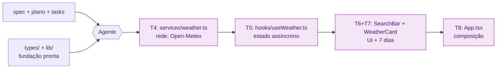

## Step 5: Code — Peça ao Agente para Construir o App

> As tasks estão registradas. Agora o código nasce como **consequência** delas — mas quem digita não é você, é o agente. Seu trabalho é entregar a ele os artefatos que decidem o "o quê" (spec, plano, tasks) e depois **validar** o resultado contra os critérios de aceite. Isso é o que `/implement` faz no spec-kit, o que o agente "Dev" faz no BMAD-METHOD — e é o que você vai fazer agora com o Copilot: construir o app inteiro a partir da especificação.

### Conceito

Em Spec-Driven Development, escrever código não é o começo do trabalho — é a **execução das tasks que rastreiam os critérios de aceite**. Você não decide "o que" construir aqui; isso já foi decidido na spec e no plano. Quando spec, plano e tasks estão prontos, a implementação pode (e deve) ser delegada a um agente — seu papel passa a ser **especificar e validar**, não digitar cada linha.

O scaffold entrega só a **fundação** (tipos + funções puras, já testadas). Tudo o que o usuário vê — buscar cidade, chamar a API, exibir o clima atual e a previsão de 7 dias — ainda **não existe**. É isso que o agente vai construir, de dentro para fora:



> [!TIP]
> Quanto mais precisas as tasks e a spec, mais fiel o resultado do agente. Se o código gerado "inventar" algo que não está nos critérios de aceite, é sinal de que a task ou a spec estavam vagas — o ajuste é no texto, não no código.

### Objetivo

Pedir ao agente para construir o app completo (T4–T8) a partir da spec, do plano e das tasks, e então **validar** que o resultado satisfaz os critérios de aceite. Ao final, `pnpm build` compila sem erros e o fluxo completo — buscar → selecionar → ver clima atual e previsão de 7 dias — funciona no browser.

> [!NOTE]
> **Por que o app não vem pronto?** Se o código já existisse, os Steps 1–4 seriam documentação reversa de algo já feito — o oposto de *spec-driven*. Aqui a spec realmente **dirige** a construção: o agente materializa exatamente o que foi especificado, e você valida contra os `CA`.

### Mãos à obra: Peça ao agente para construir o app

A fundação já está pronta: os tipos em `src/types/weather.ts` descrevem `Location`, `WeatherData` (incluindo `daily`) e `AsyncState<T>`; as funções puras `formatTemperature`, `celsiusToFahrenheit`, `getWmoDescription` e `getWmoEmoji` já existem e estão testadas em `src/lib/`. O agente deve **reaproveitá-las**, não reimplementá-las.

1. Instale as dependências (caso ainda não tenha feito):

   ```bash
   pnpm install
   ```

2. Abra o Copilot Chat em modo **agent** e peça a construção do app citando os artefatos — o "o quê" e "onde", não o "como". Um único prompt pode conduzir toda a cadeia (rede → estado → UI → composição):

   ```text
   Construa o Weather App implementando as tasks T4–T8 de
   tasks/weather-app-tasks.md, satisfazendo os critérios de aceite de
   specs/weather-app-spec.md e seguindo a arquitetura de
   plans/weather-app-plan.md. Reaproveite os tipos de src/types/weather.ts e as
   funções de src/lib/ (formatTemperature, getWmoDescription, getWmoEmoji) — não
   as reimplemente. Implemente, nesta ordem:

   1. src/services/weather.ts — searchLocations(query) e fetchWeather(location)
      usando a Open-Meteo (geocoding count=5 language=pt; forecast current=...,
      daily=temperature_2m_max,temperature_2m_min,weather_code, timezone=auto,
      forecast_days=7). Lance erro quando a resposta não for ok (CA1.4).
   2. src/hooks/useWeather.ts — expõe { searchState, weatherState, search,
      selectLocation } com AsyncState<T>; busca vazia volta a idle; busca sem
      resultado vira erro "Nenhuma cidade encontrada." (CA1.3, CA2.5).
   3. src/components/SearchBar.tsx — input type="search" (aria-label "Nome da
      cidade"), botão "Buscar"/"Buscando..." desabilitado com input vazio (CA1.1).
   4. src/components/WeatherCard.tsx — card com aria-label "Previsão para
      {cidade}" exibindo clima atual (temp, sensação, emoji WMO, vento, umidade)
      e a seção "Próximos 7 dias" com data, máx/mín e emoji WMO dos 7 dias
      (CA2.1–CA2.4, CA5.1–CA5.3).
   5. src/App.tsx — compõe tudo: busca → lista de resultados (cada item é um
      botão com aria-label "Selecionar {cidade}, {país}") → seleção → WeatherCard.
      Trate loading e erro (mensagens de erro com role="alert").

   Não altere os tipos nem as funções de lib/. Use Tailwind para o estilo.
   ```

3. Revise o diff que o agente propôs **contra a spec**, não contra o seu gosto pessoal. Percorra os critérios de aceite: a busca lista até 5 cidades (CA1.2)? Cidade inexistente mostra "Nenhuma cidade encontrada" (CA1.3)? O card mostra clima atual (CA2.1–CA2.4) e os 7 dias (CA5.1–CA5.3)? Ele reaproveitou as funções de `lib/`? Se algo faltar ou divergir, refine o prompt citando o `CA` específico — é a spec que dirige, não o código. Esse vaivém — validar, apontar o que diverge, reajustar — é o **loop de feedback** que você vai formalizar no Step 8.

4. Verifique se o build passa:

   ```bash
   pnpm build
   ```

5. Rode o app em modo de desenvolvimento e confira o fluxo completo:

   ```bash
   pnpm dev
   ```
   Acesse `http://localhost:5173`, busque uma cidade, selecione um resultado e confirme que o clima atual **e** os 7 dias aparecem.

6. Faça commit e push da implementação:

   ```bash
   git add src/
   git commit -m "step 5: build weather app from spec (T4-T8)"
   git push origin weather-app
   ```

> [!IMPORTANT]
> O workflow de validação executa `pnpm install && pnpm build` e falha se houver erros de compilação. Como a mudança está em `src/`, o push dispara a verificação automaticamente.

<details>
<summary>Implementação de referência (caso o agente não esteja disponível, ou para comparar com o que ele gerou)</summary><br/>

**`src/services/weather.ts`** — acesso à Open-Meteo (rede):

```ts
import type { Location, WeatherData } from "../types/weather";

const GEOCODING_API = "https://geocoding-api.open-meteo.com/v1/search";
const FORECAST_API = "https://api.open-meteo.com/v1/forecast";

export async function searchLocations(query: string): Promise<Location[]> {
  if (!query.trim()) return [];

  const url = new URL(GEOCODING_API);
  url.searchParams.set("name", query.trim());
  url.searchParams.set("count", "5");
  url.searchParams.set("language", "pt");
  url.searchParams.set("format", "json");

  const response = await fetch(url.toString());
  if (!response.ok) {
    throw new Error(`Erro ao buscar localização: ${response.status}`);
  }

  const data = await response.json();
  return (data.results as Location[]) ?? [];
}

export async function fetchWeather(location: Location): Promise<WeatherData> {
  const url = new URL(FORECAST_API);
  url.searchParams.set("latitude", String(location.latitude));
  url.searchParams.set("longitude", String(location.longitude));
  url.searchParams.set(
    "current",
    "temperature_2m,apparent_temperature,weather_code,wind_speed_10m,relative_humidity_2m",
  );
  url.searchParams.set(
    "daily",
    "temperature_2m_max,temperature_2m_min,weather_code",
  );
  url.searchParams.set("timezone", "auto");
  url.searchParams.set("forecast_days", "7");

  const response = await fetch(url.toString());
  if (!response.ok) {
    throw new Error(`Erro ao buscar previsão: ${response.status}`);
  }

  const data = await response.json();
  return { location, current: data.current, daily: data.daily };
}
```

**`src/hooks/useWeather.ts`** — estado assíncrono:

```ts
import { useCallback, useState } from "react";
import { fetchWeather, searchLocations } from "../services/weather";
import type { AsyncState, Location, WeatherData } from "../types/weather";

export function useWeather() {
  const [searchState, setSearchState] = useState<AsyncState<Location[]>>({
    status: "idle",
  });
  const [weatherState, setWeatherState] = useState<AsyncState<WeatherData>>({
    status: "idle",
  });

  const search = useCallback(async (query: string) => {
    if (!query.trim()) {
      setSearchState({ status: "idle" });
      return;
    }
    setSearchState({ status: "loading" });
    try {
      const locations = await searchLocations(query);
      if (locations.length === 0) {
        setSearchState({ status: "error", message: "Nenhuma cidade encontrada." });
      } else {
        setSearchState({ status: "success", data: locations });
      }
    } catch (err) {
      setSearchState({
        status: "error",
        message: err instanceof Error ? err.message : "Erro ao buscar cidade.",
      });
    }
  }, []);

  const selectLocation = useCallback(async (location: Location) => {
    setWeatherState({ status: "loading" });
    setSearchState({ status: "idle" });
    try {
      const data = await fetchWeather(location);
      setWeatherState({ status: "success", data });
    } catch (err) {
      setWeatherState({
        status: "error",
        message: err instanceof Error ? err.message : "Erro ao buscar previsão.",
      });
    }
  }, []);

  return { searchState, weatherState, search, selectLocation };
}
```

**`src/components/SearchBar.tsx`**:

```tsx
import { type FormEvent, useState } from "react";

interface SearchBarProps {
  onSearch: (query: string) => void;
  isLoading?: boolean;
}

export function SearchBar({ onSearch, isLoading = false }: SearchBarProps) {
  const [query, setQuery] = useState("");

  function handleSubmit(e: FormEvent) {
    e.preventDefault();
    if (query.trim()) onSearch(query.trim());
  }

  return (
    <form onSubmit={handleSubmit} className="flex gap-2 w-full max-w-md">
      <input
        type="search"
        value={query}
        onChange={(e) => setQuery(e.target.value)}
        placeholder="Buscar cidade..."
        aria-label="Nome da cidade"
        className="flex-1 px-4 py-2 rounded-lg border border-gray-300 focus:outline-none focus:ring-2 focus:ring-blue-500"
        disabled={isLoading}
      />
      <button
        type="submit"
        disabled={isLoading || !query.trim()}
        className="px-4 py-2 bg-blue-600 text-white rounded-lg disabled:opacity-50 hover:bg-blue-700 transition-colors"
      >
        {isLoading ? "Buscando..." : "Buscar"}
      </button>
    </form>
  );
}
```

**`src/components/WeatherCard.tsx`** — clima atual **e** previsão de 7 dias (F5):

```tsx
import { formatTemperature } from "../lib/temperature";
import { getWmoDescription, getWmoEmoji } from "../lib/wmo";
import type { WeatherData } from "../types/weather";

interface WeatherCardProps {
  data: WeatherData;
}

export function WeatherCard({ data }: WeatherCardProps) {
  const { location, current, daily } = data;
  const weatherEmoji = getWmoEmoji(current.weather_code);
  const weatherDescription = getWmoDescription(current.weather_code);

  return (
    <div
      className="bg-white rounded-xl shadow-lg p-6 w-full max-w-md"
      aria-label={`Previsão para ${location.name}`}
    >
      <div className="flex justify-between items-start">
        <div>
          <h2 className="text-2xl font-bold text-gray-800">{location.name}</h2>
          <p className="text-gray-500 text-sm">
            {location.admin1 ? `${location.admin1}, ` : ""}
            {location.country}
          </p>
        </div>
        <span className="text-5xl" role="img" aria-label={weatherDescription}>
          {weatherEmoji}
        </span>
      </div>

      <div className="mt-4">
        <p className="text-6xl font-light text-gray-800">
          {formatTemperature(current.temperature_2m, "C")}
        </p>
        <p className="text-gray-500 mt-1">
          Sensação: {formatTemperature(current.apparent_temperature, "C")}
        </p>
        <p className="text-gray-600 mt-1">{weatherDescription}</p>
      </div>

      <div className="mt-4 grid grid-cols-2 gap-4 text-sm text-gray-600">
        <div>
          <span className="font-medium">Vento:</span>{" "}
          {Math.round(current.wind_speed_10m)} km/h
        </div>
        <div>
          <span className="font-medium">Umidade:</span>{" "}
          {current.relative_humidity_2m}%
        </div>
      </div>

      <div className="mt-6 border-t border-gray-100 pt-4">
        <h3 className="text-sm font-semibold text-gray-700 mb-2">
          Próximos 7 dias
        </h3>
        <ul className="space-y-1">
          {daily.time.map((day, i) => (
            <li
              key={day}
              className="flex items-center justify-between text-sm text-gray-600"
            >
              <span className="w-12 font-medium">
                {new Date(day).toLocaleDateString("pt-BR", { weekday: "short" })}
              </span>
              <span
                className="text-xl"
                role="img"
                aria-label={getWmoDescription(daily.weather_code[i])}
              >
                {getWmoEmoji(daily.weather_code[i])}
              </span>
              <span className="tabular-nums">
                {formatTemperature(daily.temperature_2m_max[i], "C")} /{" "}
                {formatTemperature(daily.temperature_2m_min[i], "C")}
              </span>
            </li>
          ))}
        </ul>
      </div>
    </div>
  );
}
```

**`src/App.tsx`** — composição e fluxo:

```tsx
import { SearchBar } from "./components/SearchBar";
import { WeatherCard } from "./components/WeatherCard";
import { useWeather } from "./hooks/useWeather";
import type { Location } from "./types/weather";

export default function App() {
  const { searchState, weatherState, search, selectLocation } = useWeather();

  function handleLocationSelect(location: Location) {
    selectLocation(location);
  }

  return (
    <div className="min-h-screen bg-gradient-to-br from-blue-50 to-blue-100 flex flex-col items-center justify-start pt-16 px-4">
      <header className="mb-8 text-center">
        <h1 className="text-4xl font-bold text-blue-800 mb-2">🌤️ Weather App</h1>
        <p className="text-blue-600">Previsão do tempo com Open-Meteo</p>
      </header>

      <SearchBar onSearch={search} isLoading={searchState.status === "loading"} />

      {searchState.status === "loading" && (
        <output className="mt-4 text-gray-500">Buscando cidades...</output>
      )}

      {searchState.status === "error" && (
        <p className="mt-4 text-red-600" role="alert">
          {searchState.message}
        </p>
      )}

      {searchState.status === "success" && searchState.data.length > 0 && (
        <ul className="mt-4 w-full max-w-md bg-white rounded-lg shadow divide-y">
          {searchState.data.map((location) => (
            <li key={location.id}>
              <button
                type="button"
                onClick={() => handleLocationSelect(location)}
                className="w-full text-left px-4 py-3 hover:bg-blue-50 transition-colors"
                aria-label={`Selecionar ${location.name}, ${location.country}`}
              >
                <span className="font-medium">{location.name}</span>
                {location.admin1 && (
                  <span className="text-gray-500 text-sm ml-2">
                    {location.admin1}
                  </span>
                )}
                <span className="text-gray-400 text-sm ml-2">
                  {location.country}
                </span>
              </button>
            </li>
          ))}
        </ul>
      )}

      {weatherState.status === "loading" && (
        <output className="mt-8 text-gray-500">Carregando previsão...</output>
      )}

      {weatherState.status === "error" && (
        <p className="mt-8 text-red-600" role="alert">
          {weatherState.message}
        </p>
      )}

      {weatherState.status === "success" && (
        <div className="mt-8">
          <WeatherCard data={weatherState.data} />
        </div>
      )}
    </div>
  );
}
```

</details>

### Checkpoint

O Step 5 é aprovado quando:

- [ ] `src/services/`, `src/hooks/`, `src/components/` e `src/App.tsx` foram construídos (T4–T8)
- [ ] `pnpm build` compila sem erros de TypeScript
- [ ] O fluxo completo (buscar → selecionar → clima atual + 7 dias) funciona no browser

Repare: você não digitou o app à mão — deu ao agente a spec, o plano e as tasks e pediu para traduzi-los em código. Sua responsabilidade foi **validar** que o resultado satisfaz os critérios de aceite, não escrever cada linha. Isso é `/implement`.

### Em outras ferramentas

| Ferramenta | Como trata a implementação |
|---|---|
| **spec-kit** | O comando `/implement` executa cada task do `tasks.md` em sequência, gerando o código que rastreia os critérios de aceite |
| **OpenSpec** | O código entra via PR que **referencia a spec**; o merge só é permitido se a implementação corresponde à change proposal aprovada |
| **BMAD-METHOD** | O agente "Dev" implementa cada user story criada pelo SM, seguindo o Architecture Document como contrato |

<details>
<summary>Problemas?</summary><br/>

- **"O agente gerou algo diferente do esperado"**: use a implementação de referência acima como comparação, ou refine o prompt citando o trecho exato da spec (o `CA`) que não foi atendido. Lembre: o ajuste é na spec/prompt, não no código à mão.
- **"O agente reimplementou funções de lib/ ou alterou os tipos"**: peça para reverter e reaproveitar `src/lib/` e `src/types/` — eles são a fundação e não devem mudar.
- **"'daily' does not exist on type..."**: o `WeatherCard` precisa desestruturar `daily` de `data` (`const { location, current, daily } = data;`) para exibir os 7 dias.
- **"A previsão não aparece"**: o card só renderiza depois de selecionar uma cidade nos resultados da busca. Verifique também o console do navegador por erros de rede.
- **"Build falhou"**: rode `pnpm tsc --noEmit` para ver todos os erros de tipo de uma vez.

</details>
