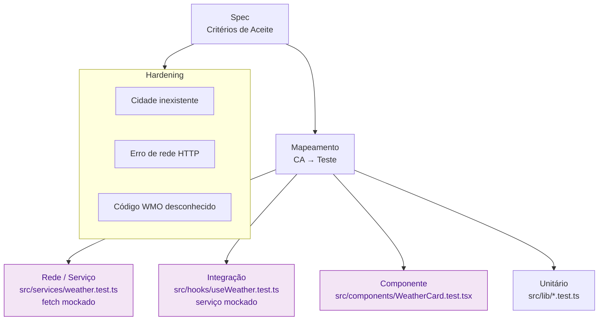

## Step 6: Verify — Test + Hardening

> O código está escrito. Mas como sabemos que ele faz o que a spec prometeu? **Testamos.** E como garantimos que os casos extremos que a spec mencionou funcionam? **Hardening.** Test e Hardening não são fases extras — são a prova de que a spec foi cumprida.

### Conceito

Testes não são uma fase extra: são a prova de que a spec foi cumprida. Cada critério de aceite vira pelo menos um teste, e os edge cases que a spec menciona explicitamente viram testes de *hardening*. Se está na spec, tem teste; se não está na spec, questione por que está no código.

Mas testar **não é só clicar na UI**. O app tem camadas — rede, estado, apresentação — e cada uma se verifica no seu próprio nível, com a camada de baixo *mockada*. Um teste de rede não abre o browser: ele mocka o `fetch` e prova que a URL e os parâmetros da Open-Meteo estão corretos e que um erro HTTP vira exceção. É mais rápido, mais estável e aponta a falha com precisão.



**O que já existe:**

O scaffold já traz os testes **unitários** das funções puras:
- `src/lib/temperature.test.ts` — testa CA3.1 a CA3.4 (conversão de temperatura)
- `src/lib/wmo.test.ts` — testa CA4.1 a CA4.3 (mapeamento WMO)

Mas o app que o agente construiu no Step 5 — o serviço de rede, o hook de estado e os componentes — ainda **não tem nenhum teste**. Se um `git revert` desfizesse o Step 5 por engano, só o build acusaria; nenhum teste provaria que o comportamento da spec foi perdido. É isso que você resolve agora, cobrindo cada camada no seu nível.

### Objetivo

Rodar os testes unitários que já vêm no scaffold e escrever os testes que faltam para o app construído no Step 5, em **três níveis**: rede (serviço, com `fetch` mockado), integração (hook, com serviço mockado) e componente (`WeatherCard`). Ao final, adicionar um teste de *hardening* para um edge case. `pnpm test` deve passar — é isso que o workflow verifica.

> [!NOTE]
> Se um teste reprovar aqui, resista a corrigir às cegas. Um vermelho é **feedback** — e no Step 8 ele volta ao plano e às tasks pelo `plan.agent.md`, em vez de virar um remendo direto no código.

### Mãos à obra: Teste cada camada do app

**Parte A — Execute os testes unitários que já existem**

1. Execute a suíte:

   ```bash
   pnpm test
   ```

   Os testes de `src/lib/` devem passar. Observe como cada um mapeia diretamente a um critério de aceite da spec.

2. Verifique a cobertura:

   ```bash
   pnpm test:coverage
   ```

**Parte B — Teste a camada de rede (serviço)**

O serviço `src/services/weather.ts` fala com a Open-Meteo. Não queremos bater na API real num teste unitário — queremos provar que ele **monta a URL certa** e **trata erros HTTP**. Para isso, mockamos o `fetch`. Peça ao agente citando os critérios de aceite, não a implementação:

1. Abra o Copilot Chat em modo **agent** e peça:

   ```text
   Crie src/services/weather.test.ts com vitest, mockando globalThis.fetch com
   vi.spyOn (sem bater na rede real). Cubra: (a) CA1.2 — searchLocations monta a
   URL de geocoding com name, count=5 e language=pt e retorna os resultados;
   (b) searchLocations("   ") retorna [] sem chamar fetch; (c) CA1.4 —
   searchLocations lança erro quando a resposta tem status não-ok; (d) fetchWeather
   monta a URL de forecast com timezone=auto, forecast_days=7 e daily contendo
   temperature_2m_max; (e) CA1.4 — fetchWeather lança erro em resposta não-ok.
   Verifique os parâmetros lendo a URL passada ao fetch mockado, não a resposta.
   ```

2. Revise: os testes leem a URL efetivamente passada ao `fetch` (via `mock.calls`) para checar os parâmetros? Cobrem tanto o caminho feliz quanto o erro HTTP (CA1.4)? Nenhum deles faz uma requisição real?

3. Rode e confirme que passam:

   ```bash
   pnpm test
   ```

<details>
<summary>Implementação de referência (rede)</summary><br/>

Crie `src/services/weather.test.ts`:

```ts
import { afterEach, describe, expect, it, vi } from "vitest";
import type { Location } from "../types/weather";
import { fetchWeather, searchLocations } from "./weather";

afterEach(() => vi.restoreAllMocks());

const location: Location = {
  id: 1,
  name: "São Paulo",
  latitude: -23.5,
  longitude: -46.6,
  country: "Brasil",
  country_code: "BR",
};

describe("searchLocations — rede", () => {
  it("CA1.2: monta a URL de geocoding e retorna os resultados", async () => {
    const results = [location];
    const fetchMock = vi
      .spyOn(globalThis, "fetch")
      .mockResolvedValue(new Response(JSON.stringify({ results }), { status: 200 }));

    const locations = await searchLocations("São Paulo");

    expect(locations).toHaveLength(1);
    const url = new URL(fetchMock.mock.calls[0][0] as string);
    expect(url.hostname).toBe("geocoding-api.open-meteo.com");
    expect(url.searchParams.get("name")).toBe("São Paulo");
    expect(url.searchParams.get("count")).toBe("5");
    expect(url.searchParams.get("language")).toBe("pt");
  });

  it("retorna [] para query vazia, sem chamar a rede", async () => {
    const fetchMock = vi.spyOn(globalThis, "fetch");
    expect(await searchLocations("   ")).toEqual([]);
    expect(fetchMock).not.toHaveBeenCalled();
  });

  it("CA1.4: lança erro quando a resposta não é ok", async () => {
    vi.spyOn(globalThis, "fetch").mockResolvedValue(new Response("", { status: 500 }));
    await expect(searchLocations("x")).rejects.toThrow(/500/);
  });
});

describe("fetchWeather — rede", () => {
  it("monta a URL de forecast com daily e forecast_days=7", async () => {
    const payload = { current: {}, daily: { time: [] } };
    const fetchMock = vi
      .spyOn(globalThis, "fetch")
      .mockResolvedValue(new Response(JSON.stringify(payload), { status: 200 }));

    const data = await fetchWeather(location);

    expect(data.location).toEqual(location);
    const url = new URL(fetchMock.mock.calls[0][0] as string);
    expect(url.hostname).toBe("api.open-meteo.com");
    expect(url.searchParams.get("forecast_days")).toBe("7");
    expect(url.searchParams.get("timezone")).toBe("auto");
    expect(url.searchParams.get("daily")).toContain("temperature_2m_max");
  });

  it("CA1.4: lança erro quando a resposta não é ok", async () => {
    vi.spyOn(globalThis, "fetch").mockResolvedValue(new Response("", { status: 404 }));
    await expect(fetchWeather(location)).rejects.toThrow(/404/);
  });
});
```

</details>

4. Faça commit e push:

   ```bash
   git add src/services/weather.test.ts
   git commit -m "step 6: network tests for weather service"
   git push origin weather-app
   ```

**Parte C — Teste a camada de estado (hook, integração)**

O hook `useWeather` orquestra o serviço e expõe estados assíncronos. Aqui mockamos o **serviço** (não o `fetch`) e verificamos as transições de estado. Peça ao agente:

1. Abra o Copilot Chat em modo **agent** e peça:

   ```text
   Crie src/hooks/useWeather.test.ts usando renderHook, act e waitFor de
   @testing-library/react e vitest, mockando o módulo ../services/weather com
   vi.spyOn. Cubra: (a) CA2.5 — ao chamar search, searchState passa por "loading"
   e chega a "success" quando o serviço retorna locais; (b) CA1.3 — quando
   searchLocations retorna [], searchState vira "error" com a mensagem
   "Nenhuma cidade encontrada."; (c) selectLocation leva weatherState a "success"
   quando fetchWeather resolve. Não bata na rede real — mocke o serviço.
   ```

2. Revise: o teste mocka o **serviço** (não o `fetch`), provando que o hook reage corretamente a cada retorno? Verifica o estado intermediário `loading` (CA2.5) e a mensagem de erro exata (CA1.3)?

3. Rode e confirme:

   ```bash
   pnpm test
   ```

<details>
<summary>Implementação de referência (integração)</summary><br/>

Crie `src/hooks/useWeather.test.ts`:

```tsx
import { act, renderHook, waitFor } from "@testing-library/react";
import { afterEach, describe, expect, it, vi } from "vitest";
import * as service from "../services/weather";
import type { Location, WeatherData } from "../types/weather";
import { useWeather } from "./useWeather";

afterEach(() => vi.restoreAllMocks());

const location: Location = {
  id: 1,
  name: "São Paulo",
  latitude: -23.5,
  longitude: -46.6,
  country: "Brasil",
  country_code: "BR",
};

describe("useWeather — integração", () => {
  it("CA2.5: passa por loading e chega a success ao buscar", async () => {
    vi.spyOn(service, "searchLocations").mockResolvedValue([location]);
    const { result } = renderHook(() => useWeather());

    act(() => {
      result.current.search("São Paulo");
    });
    expect(result.current.searchState.status).toBe("loading");

    await waitFor(() =>
      expect(result.current.searchState.status).toBe("success"),
    );
  });

  it("CA1.3: busca sem resultado vira erro amigável", async () => {
    vi.spyOn(service, "searchLocations").mockResolvedValue([]);
    const { result } = renderHook(() => useWeather());

    act(() => {
      result.current.search("xyzxyz");
    });
    await waitFor(() =>
      expect(result.current.searchState.status).toBe("error"),
    );
    expect(result.current.searchState).toMatchObject({
      message: "Nenhuma cidade encontrada.",
    });
  });

  it("selectLocation expõe a previsão em weatherState", async () => {
    const weather = {
      location,
      current: {},
      daily: { time: [] },
    } as unknown as WeatherData;
    vi.spyOn(service, "fetchWeather").mockResolvedValue(weather);
    const { result } = renderHook(() => useWeather());

    act(() => {
      result.current.selectLocation(location);
    });
    await waitFor(() =>
      expect(result.current.weatherState.status).toBe("success"),
    );
  });
});
```

</details>

4. Faça commit e push:

   ```bash
   git add src/hooks/useWeather.test.ts
   git commit -m "step 6: integration tests for useWeather hook"
   git push origin weather-app
   ```

**Parte D — Teste a camada de apresentação (componente + F5)**

Agora o nível de UI: `WeatherCard` renderiza o clima atual e a previsão de 7 dias (F5). Peça um teste de componente citando os critérios de aceite:

1. Abra o Copilot Chat em modo **agent** e peça:

   ```text
   Crie src/components/WeatherCard.test.tsx usando @testing-library/react e
   vitest. Renderize WeatherCard com um WeatherData mockado contendo 7 dias em
   `daily` (time, temperature_2m_max, temperature_2m_min, weather_code, todos
   com valores distintos entre si). Escreva um teste por critério de aceite:
   CA5.1 (existe uma entrada de previsão para cada um dos 7 dias), CA5.2
   (a temperatura máxima e a mínima de cada dia aparecem no documento) e CA5.3
   (o emoji/aria-label da condição WMO de cada dia aparece no documento, use
   getWmoDescription de src/lib/wmo.ts para montar a expectativa). Não teste
   detalhes de estilo ou classes CSS, só o que a spec promete.
   ```

2. Revise o teste gerado: ele nomeia cada `it()` com o CA que verifica (CA5.1/CA5.2/CA5.3)? Usa dados mockados com 7 dias distintos (evitando falsos positivos por valores repetidos)? Evita depender de formatação sensível a timezone/locale (como o dia da semana), preferindo checar o número de entradas e os valores de temperatura/emoji?

3. Rode o teste para confirmar que passa contra a implementação da F5 do Step 5:

   ```bash
   pnpm test
   ```

4. Faça commit e push:

   ```bash
   git add src/components/WeatherCard.test.tsx
   git commit -m "step 6: component test for 7-day forecast (F5)"
   git push origin weather-app
   ```

<details>
<summary>Implementação de referência (componente)</summary><br/>

Crie `src/components/WeatherCard.test.tsx`:

```tsx
import { render, screen } from "@testing-library/react";
import { describe, expect, it } from "vitest";
import { getWmoDescription } from "../lib/wmo";
import type { WeatherData } from "../types/weather";
import { WeatherCard } from "./WeatherCard";

const mockData: WeatherData = {
  location: {
    id: 1,
    name: "São Paulo",
    latitude: -23.5,
    longitude: -46.6,
    country: "Brasil",
    country_code: "BR",
    admin1: "São Paulo",
  },
  current: {
    temperature_2m: 18,
    apparent_temperature: 20,
    weather_code: 2,
    wind_speed_10m: 10,
    relative_humidity_2m: 60,
  },
  daily: {
    time: [
      "2026-07-17",
      "2026-07-18",
      "2026-07-19",
      "2026-07-20",
      "2026-07-21",
      "2026-07-22",
      "2026-07-23",
    ],
    temperature_2m_max: [25, 26, 27, 28, 29, 30, 31],
    temperature_2m_min: [10, 11, 12, 13, 14, 15, 16],
    weather_code: [0, 1, 3, 45, 61, 71, 95],
  },
};

describe("WeatherCard — previsão de 7 dias (F5)", () => {
  it("CA5.1: exibe uma entrada de previsão para cada um dos 7 dias", () => {
    render(<WeatherCard data={mockData} />);
    // 1 emoji do clima atual + 7 emojis da previsão diária
    expect(screen.getAllByRole("img").length).toBeGreaterThanOrEqual(8);
  });

  it("CA5.2: exibe a temperatura máxima e a mínima de cada dia", () => {
    render(<WeatherCard data={mockData} />);
    for (const max of mockData.daily.temperature_2m_max) {
      expect(screen.getByText(new RegExp(`${max}°C`))).toBeInTheDocument();
    }
    for (const min of mockData.daily.temperature_2m_min) {
      expect(screen.getByText(new RegExp(`${min}°C`))).toBeInTheDocument();
    }
  });

  it("CA5.3: exibe o emoji da condição WMO de cada dia", () => {
    render(<WeatherCard data={mockData} />);
    for (const code of mockData.daily.weather_code) {
      expect(
        screen.getAllByLabelText(getWmoDescription(code)).length,
      ).toBeGreaterThan(0);
    }
  });
});
```

</details>

**Parte E — Adicione um teste de hardening**

O teste de hardening para o edge case de código WMO desconhecido (CA4.3) já existe no scaffold. Vamos adicionar novos testes de hardening para a fórmula de conversão de temperatura (CA3.1) em um valor extremo — pedindo ao agente, em vez de escrever à mão:

1. Abra `src/lib/wmo.test.ts` e confirme que o teste para código desconhecido já existe (CA4.3 — nada a fazer aqui).

2. Abra o Copilot Chat em modo **agent** e peça os testes de hardening citando os critérios de aceite que eles provam, não a implementação:

   ```text
   Adicione testes de hardening ao final de src/lib/temperature.test.ts, dentro
   de um describe("edge cases — hardening"). Cubra dois casos que a spec já
   promete mas ainda não tem teste: CA3.1 (a fórmula de conversão
   celsiusToFahrenheit vale para qualquer entrada, inclusive o zero absoluto,
   -273.15°C = -459.67°F) e CA2.1 (formatTemperature nunca deve exibir "-0°C",
   sempre "0°C" para zero negativo). Não altere a implementação em
   src/lib/temperature.ts, só adicione os testes.
   ```

3. Revise os testes gerados contra CA3.1 e CA2.1: eles testam a fórmula em um extremo real (não um valor arbitrário) e o caso de zero negativo? Se o agente alterou a implementação em vez de só adicionar testes, peça para reverter — hardening prova comportamento existente, não adiciona comportamento novo.

4. Execute os testes para confirmar que passam:

   ```bash
   pnpm test
   ```

5. Faça commit e push:

   ```bash
   git add src/lib/temperature.test.ts
   git commit -m "step 6: hardening tests for edge cases"
   git push origin weather-app
   ```

> [!IMPORTANT]
> O workflow de validação executará `pnpm test` e falhará se qualquer teste falhar.

> [!NOTE]
> **Por que testar em vários níveis, e não só a UI?** Um teste E2E que abre o browser é lento e, quando falha, não diz *qual* camada quebrou. Ao testar a rede isoladamente (URL/parâmetros/erros HTTP), o estado isoladamente (transições do hook) e a apresentação isoladamente (o que o componente renderiza), cada falha aponta direto para a camada responsável. O E2E do próximo step continua valioso — mas como prova do fluxo completo, não como único teste.

> [!NOTE]
> **Por que hardening não é "gold-plating"?** Hardening cobre os edge cases de uma regra que **já está** na spec — não cria comportamento novo. A CA3.1 diz "a conversão segue a fórmula F = (C × 9/5) + 32", sem limitar a faixa de entrada; testar em -273.15°C (zero absoluto) só prova que a mesma fórmula, já prometida, se sustenta em um extremo. É por isso que dá para pedir esses testes a um agente com segurança: o "o quê" já está delimitado pela spec, e cabe a você validar que o agente não extrapolou esse limite.

<details>
<summary>Implementação de referência (hardening)</summary><br/>

Adicione ao final de `src/lib/temperature.test.ts`:

```typescript
describe("edge cases — hardening", () => {
  it("lida com temperatura muito baixa (-273.15°C, zero absoluto)", () => {
    // Zero absoluto = -459.67°F
    expect(celsiusToFahrenheit(-273.15)).toBeCloseTo(-459.67, 0);
  });

  it("formatTemperature com zero negativo exibe 0, não -0", () => {
    const result = formatTemperature(-0, "C");
    expect(result).toBe("0°C");
  });
});
```

</details>


### Checkpoint

O Step 6 é aprovado quando:

- [ ] `pnpm test` passa
- [ ] `src/services/weather.test.ts` cobre a camada de rede (URL/parâmetros + erro HTTP, CA1.2/CA1.4) com `fetch` mockado
- [ ] `src/hooks/useWeather.test.ts` cobre a camada de estado (transições loading/success/error, CA2.5/CA1.3) com o serviço mockado
- [ ] `src/components/WeatherCard.test.tsx` cobre a camada de apresentação (CA5.1, CA5.2, CA5.3)
- [ ] Os testes de hardening (CA3.1, CA2.1) foram adicionados a `src/lib/temperature.test.ts`

O workflow roda toda a suíte. Agora o app não é testado só "pela tela": cada camada — rede, estado e apresentação — tem seu próprio teste, e os de hardening reforçam os edge cases da spec.

### Em outras ferramentas

| Ferramenta | Como trata testes e hardening |
|---|---|
| **spec-kit** | Após `/implement`, o `/review` verifica se os critérios de aceite têm cobertura de teste; sugere testes ausentes |
| **OpenSpec** | A spec define "test requirements" como seção obrigatória; PR só é aprovado se todos os test requirements tiverem testes correspondentes |
| **BMAD-METHOD** | O agente "QA" recebe o PRD e o código, e produz um "Test Plan" cobrindo happy path, edge cases e critérios de aceite; o agente "Dev" implementa os testes faltantes |

<details>
<summary>Problemas?</summary><br/>

- **"Testes falham com erros de import"**: confirme que o Step 5 foi concluído — `src/services/weather.ts`, `src/hooks/useWeather.ts` e `src/components/WeatherCard.tsx` precisam existir para os testes importá-los.
- **"vitest: command not found"**: execute `pnpm install` primeiro para instalar as dependências.
- **"O teste de rede está batendo na API real / é lento"**: confirme que o `fetch` foi mockado com `vi.spyOn(globalThis, "fetch")` **antes** de chamar o serviço, e que o `afterEach(() => vi.restoreAllMocks())` está presente.
- **"O mock do serviço não é aplicado no teste do hook"**: use `vi.spyOn(service, "searchLocations")` importando o módulo como `import * as service from "../services/weather"`; o hook precisa importar do mesmo caminho.
- **"O teste da F5 falha porque não encontra `daily`"**: confirme que o `WeatherCard` do Step 5 renderiza o array `daily`.
- **"`getByText` encontrou múltiplos elementos"**: use valores de temperatura distintos entre si no mock para evitar colisão de texto.
- **"Por que o teste de -0 passa?"**: o JavaScript tem `-0` e `0` como valores distintos, mas `formatTemperature` já normaliza esse caso; se o agente reescrever a função e o teste começar a falhar, é sinal de que a normalização foi perdida.

</details>
