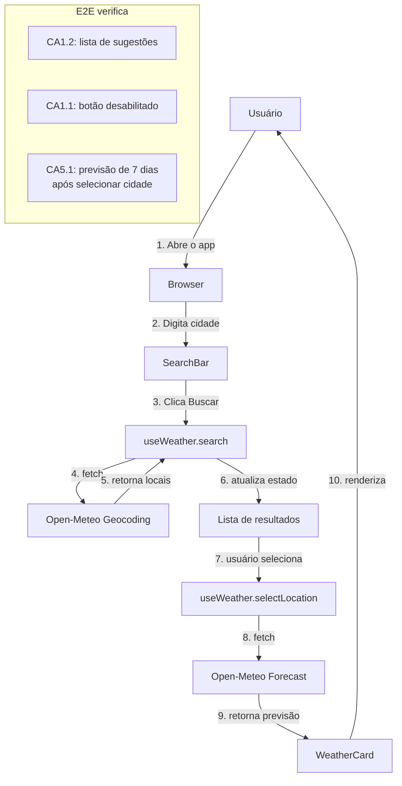

## Step 7: E2E — A Spec pelos Olhos do Usuário

> Testes unitários verificam funções isoladas. Mas o usuário não usa funções — ele usa o sistema inteiro. Testes E2E são **a spec vista pelos olhos do usuário**: eles simulam exatamente o que um humano faria no browser.

### Conceito

Testes unitários verificam funções isoladas; testes E2E verificam o sistema inteiro pelos olhos do usuário. Eles simulam exatamente o que uma pessoa faria no browser — digitar, clicar, esperar o resultado — e por isso validam o fluxo completo da spec. Um E2E não substitui os testes unitários: quando ele falha, são os unitários que ajudam a isolar onde está o problema.



Repare que CA5.1 já tem teste de componente (Step 6), mas com dados mockados — nenhum teste ainda comprova que o fluxo real (busca → seleção → fetch → renderização) entrega os 7 dias de ponta a ponta. É exatamente isso que o E2E prova, e o mock não.

### Objetivo

Criar a suíte de testes E2E que valida o fluxo do usuário de ponta a ponta: o arquivo base (título, campo de busca, botão desabilitado, fluxo de busca), um teste para o estado de carregamento e um teste que comprova a F5 (previsão de 7 dias) no fluxo real. Ao final, `pnpm test:e2e` deve passar — é o que o workflow executa (com o Chromium instalado).

### Mãos à obra: Crie e expanda os testes E2E

**Parte A — Instale os browsers do Playwright**

1. Se ainda não instalou os browsers (fora do devcontainer):

   ```bash
   pnpm exec playwright install chromium --with-deps
   ```

**Parte B — Crie o arquivo base de testes E2E**

Ao contrário das camadas internas (rede/estado/componente) testadas no Step 6, o E2E exercita o app inteiro pelo browser. Crie a suíte base que valida os critérios de aceite visíveis logo na abertura. Peça ao agente citando o que cada teste prova:

1. Abra o Copilot Chat em modo **agent** e peça:

   ```text
   Crie e2e/search.spec.ts com Playwright (@playwright/test). Dentro de um
   test.describe, com um beforeEach que faz page.goto("/"), escreva os testes:
   (a) exibe o heading "Weather App"; (b) exibe o campo de busca (role searchbox)
   e o botão "Buscar" — CA1.1 visível; (c) o botão "Buscar" fica desabilitado
   com o campo vazio — CA1.1; (d) ao preencher "São Paulo" e clicar em Buscar,
   aparece um resultado (listitem) OU um estado de alerta/status — CA1.2, com
   timeout de 10s por causa da rede real.
   ```

2. Revise: os seletores usam papéis acessíveis (`getByRole("searchbox")`, `getByRole("button", { name: /Buscar/i })`) em vez de classes CSS? O teste de busca tolera latência de rede (timeout) e o caminho de erro?

3. Execute os testes E2E:

   ```bash
   pnpm test:e2e
   ```

4. Veja o relatório HTML gerado:

   ```bash
   pnpm exec playwright show-report
   ```

<details>
<summary>Implementação de referência (suíte base)</summary><br/>

Crie `e2e/search.spec.ts`:

```typescript
import { expect, test } from "@playwright/test";

test.describe("Weather App — busca de cidade", () => {
  test.beforeEach(async ({ page }) => {
    await page.goto("/");
  });

  test("exibe o título da aplicação", async ({ page }) => {
    await expect(
      page.getByRole("heading", { name: /Weather App/i }),
    ).toBeVisible();
  });

  test("exibe campo de busca e botão", async ({ page }) => {
    await expect(page.getByRole("searchbox")).toBeVisible();
    await expect(page.getByRole("button", { name: /Buscar/i })).toBeVisible();
  });

  test("botão Buscar fica desabilitado quando o campo está vazio", async ({
    page,
  }) => {
    await expect(page.getByRole("button", { name: /Buscar/i })).toBeDisabled();
  });

  test("busca por cidade e exibe resultados", async ({ page }) => {
    await page.getByRole("searchbox").fill("São Paulo");
    await page.getByRole("button", { name: /Buscar/i }).click();
    // Aguarda resultados ou estado de loading/error
    await expect(
      page
        .getByRole("listitem")
        .first()
        .or(page.getByRole("alert"))
        .or(page.getByRole("status")),
    ).toBeVisible({ timeout: 10000 });
  });
});
```

</details>

5. Faça commit e push:

   ```bash
   git add e2e/search.spec.ts
   git commit -m "step 7: base e2e suite for search flow"
   git push origin weather-app
   ```

**Parte C — Adicione um teste E2E para estado de loading**

1. Abra `e2e/search.spec.ts` e adicione o seguinte teste ao `describe` existente:

   ```typescript
   test("exibe estado de carregamento durante a busca", async ({ page }) => {
     // Intercepta a requisição para simular latência
     await page.route("**/geocoding-api.open-meteo.com/**", async (route) => {
       await new Promise((resolve) => setTimeout(resolve, 500));
       await route.continue();
     });

     await page.getByRole("searchbox").fill("London");
     await page.getByRole("button", { name: /Buscar/i }).click();

     // Verifica que o botão fica em estado de carregamento
     await expect(page.getByRole("button", { name: /Buscando/i })).toBeVisible();
   });
   ```

2. Execute os testes novamente:

   ```bash
   pnpm test:e2e
   ```

3. Faça commit e push:

   ```bash
   git add e2e/search.spec.ts
   git commit -m "step 7: e2e test for loading state"
   git push origin weather-app
   ```

**Parte D — Comprove a F5 (previsão de 7 dias) no fluxo real**

O teste de componente do Step 6 usa dados mockados — prova que `WeatherCard` sabe renderizar 7 dias, mas não que a busca real entrega esses dados. Peça ao agente um teste E2E que cubra CA5.1 no fluxo completo (busca → seleção → previsão):

1. Abra o Copilot Chat em modo **agent** e peça:

   ```text
   Adicione a e2e/search.spec.ts um teste que: busca por "São Paulo", clica no
   primeiro resultado (botão com aria-label começando com "Selecionar"),
   espera o card de previsão aparecer (aria-label começando com "Previsão
   para") e então verifica que a seção "Próximos 7 dias" fica visível dentro
   desse card, com exatamente 7 itens de lista. Isso comprova CA5.1 no fluxo
   real, não em dados mockados.
   ```

2. Revise o teste: ele escopa a busca por "Próximos 7 dias" e pelos itens de lista **dentro do card de previsão** (não da página inteira), para não colidir com a lista de resultados de busca, que também usa `<li>`?

3. Execute os testes novamente:

   ```bash
   pnpm test:e2e
   ```

4. Faça commit e push:

   ```bash
   git add e2e/search.spec.ts
   git commit -m "step 7: e2e test for 7-day forecast (F5)"
   git push origin weather-app
   ```

<details>
<summary>Implementação de referência (caso o agente não esteja disponível, ou para comparar com o que ele gerou)</summary><br/>

Adicione ao `describe` existente em `e2e/search.spec.ts`:

```typescript
test("exibe a previsão de 7 dias após selecionar uma cidade (F5)", async ({
  page,
}) => {
  await page.getByRole("searchbox").fill("São Paulo");
  await page.getByRole("button", { name: /Buscar/i }).click();

  await page
    .getByRole("button", { name: /^Selecionar/i })
    .first()
    .click();

  const card = page.getByLabel(/^Previsão para/i);
  await expect(card).toBeVisible({ timeout: 10000 });
  await expect(card.getByText("Próximos 7 dias")).toBeVisible();
  await expect(card.getByRole("listitem")).toHaveCount(7);
});
```

</details>

> [!IMPORTANT]
> O workflow de validação executará `pnpm test:e2e` com browsers instalados. Em CI, o Playwright usa Chromium headless.

### Checkpoint

O Step 7 é aprovado quando:

- [ ] Os browsers do Playwright instalam sem erro
- [ ] `pnpm test:e2e` passa (incluindo o teste de carregamento e o teste da F5)
- [ ] O teste da F5 comprova, no fluxo real, que a previsão de 7 dias aparece após selecionar uma cidade (CA5.1)

O fluxo de busca usa a API real do Open-Meteo; se um teste falhar por rede, rode novamente antes de investigar. Um E2E vermelho por outro motivo é **feedback** para o loop do Step 8 — algo a replanejar, não um teste a silenciar.

### Em outras ferramentas

| Ferramenta | Como trata testes E2E |
|---|---|
| **spec-kit** | O `/review` gera uma checklist de critérios de aceite; o desenvolvedor marca quais têm cobertura E2E; não gera testes automaticamente |
| **OpenSpec** | Testes E2E são referenciados na spec como "acceptance tests"; o PR deve incluir um link para o test run antes de ser aprovado |
| **BMAD-METHOD** | O agente "QA" produz casos de teste E2E em formato Gherkin (Given/When/Then); outro agente ou o desenvolvedor converte em código Playwright/Cypress |

<details>
<summary>Problemas?</summary><br/>

- **"Browser not found"**: execute `pnpm exec playwright install chromium --with-deps`.
- **"Timeout exceeded"**: aumente o `timeout` no `playwright.config.ts` ou verifique se o app está rodando (`pnpm dev` em outro terminal).
- **"O teste de loading falha imediatamente"**: certifique-se de que o `page.route()` está antes do preenchimento do input — a interceptação deve ser configurada antes da ação.
- **"O teste da F5 não encontra 'Próximos 7 dias'"**: confirme que o Step 5 foi concluído (`WeatherCard` renderiza `daily`) e que a busca por "São Paulo" retornou pelo menos um resultado antes do clique.
- **"`toHaveCount(7)` encontrou mais itens que o esperado"**: escopo a busca por `listitem` dentro do card de previsão (`page.getByLabel(/^Previsão para/i)`), não na página inteira — a lista de resultados de busca também usa `<li>`.
- **"localhost:5173 recusou conexão"**: o `webServer` no `playwright.config.ts` sobe o Vite automaticamente; certifique-se de que a porta 5173 não está em uso.

</details>
