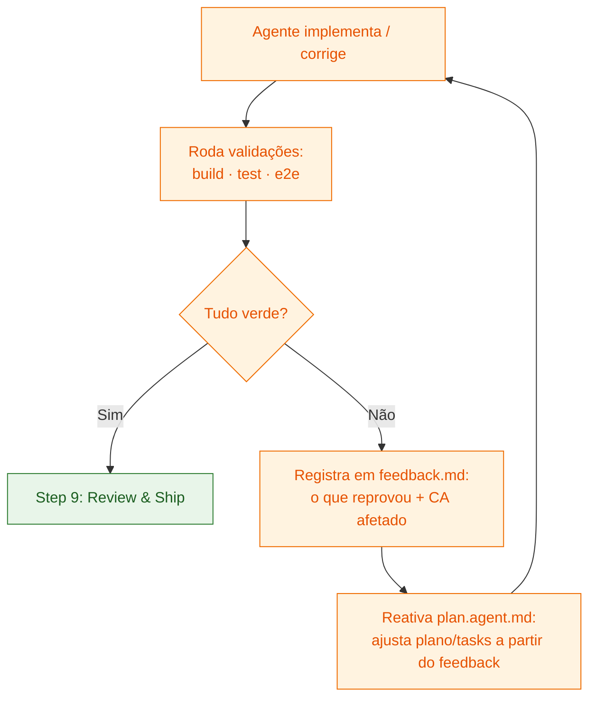

## Step 8: Iterate — O Loop de Feedback

> Você tem build, testes e E2E. Mas em SDD real, a primeira implementação **quase nunca** passa em tudo de primeira — e tudo bem. O que separa um processo maduro de um caótico é ter um **loop explícito**: quando uma validação fica vermelha, o feedback é registrado, o plano é reajustado e o agente reimplementa — até tudo ficar verde. É esse loop que você formaliza agora, antes de fazer o review e o ship.

### Conceito

Até aqui o fluxo pareceu linear: spec → plano → tasks → código → testes. Mas na prática ele é **cíclico**. Um teste que reprova, um E2E que quebra ou um build que falha não é um "erro no fim do processo" — é **feedback** que deveria voltar para o plano e para as tasks, não ser remendado direto no código.

O que torna esse loop confiável é registrá-lo. Cada iteração responde: *qual validação reprovou? qual critério de aceite foi afetado? a causa está na spec, no plano, na task ou no código? o que foi ajustado?* Esse log vivo é o `feedback.md` — o mesmo papel que o feedback estruturado tem no spec-kit, onde o resultado de uma validação retroalimenta o `/plan` e o `/implement`.



> [!NOTE]
> Repare **onde o feedback entra**: ele volta para o `plan.agent.md` (Step 3), não direto para o código. É aqui que o agente de planejamento — criado lá atrás e até agora só usado como formato — ganha seu papel real: **replanejar a partir do que as validações revelaram**. Corrigir no código sem atualizar plano/tasks faz a spec e a implementação divergirem em silêncio.

### Objetivo

Formalizar o loop de implementação com um artefato de feedback e usar o `plan.agent.md` em **modo re-planejamento**. Ao final, `feedback.md` registra o estado das validações e as iterações feitas, e build + testes + E2E passam todos.

| Artefato | Por que existe |
|---|---|
| `feedback/weather-app-feedback.md` | Log vivo do loop: cada validação vermelha, o CA afetado e o ajuste feito |

> [!IMPORTANT]
> O `feedback.md` é uma **prática documentada**, não um portão de CI. O workflow deste step valida o que realmente importa — que build, testes e E2E passam. O feedback é o que torna o *caminho até lá* rastreável.

### Mãos à obra: Rode o loop até tudo ficar verde

**Parte A — Tire uma foto do estado atual das validações**

Rode as três validações e anote quais passam e quais reprovam. É o ponto de partida do loop:

```bash
pnpm build
pnpm test
pnpm test:e2e
```

Se as três já estiverem verdes, ótimo — mas **verde no que já existe não quer dizer que a spec está completa**. Verificar de verdade é também olhar o app com olhos de usuário e deixar o que faltou virar feedback. É o que a Parte C provoca.

**Parte B — Crie o log de feedback**

1. Crie a pasta `feedback/`.
2. Crie o arquivo `feedback/weather-app-feedback.md`:

   ```markdown
   # Feedback Loop: Weather App

   > Log vivo do loop de implementação. Cada iteração registra qual validação
   > reprovou, o critério de aceite afetado, onde estava a causa (spec / plano /
   > task / código) e o ajuste feito. O loop encerra quando todas as validações
   > passam.

   ## Estado das validações

   | Validação | Comando | Status |
   |---|---|---|
   | Build | `pnpm build` | ⬜ pendente |
   | Testes (unit/integração/componente) | `pnpm test` | ⬜ pendente |
   | E2E | `pnpm test:e2e` | ⬜ pendente |

   ## Iterações

   ### Iteração 1 — <data>
   - **Validação que reprovou**: <ex.: `pnpm test` — `src/components/WeatherCard.test.tsx`>
   - **Sintoma**: <mensagem/erro observado>
   - **Critério de aceite afetado**: <ex.: CA5.4 — "primeiro dia rotulado 'Hoje'">
   - **Onde estava a causa**: <spec | plano | task | código>
   - **Ajuste**: <o que mudou e em qual artefato>
   - **Reativou o plan agent?**: <sim/não — o que o replanejamento alterou em spec/plano/tasks>
   - **Resultado da revalidação**: <✅ verde | ❌ ainda vermelho → próxima iteração>

   <!-- Você preenche a Iteração 1 na Parte C; duplique o bloco a cada nova volta. -->
   ```

**Parte C — Um feedback de verificação chega (a volta real do loop)**

Até aqui, provavelmente tudo está verde. Mas verificar não é só rodar o que já existe — é olhar o app com olhos de usuário. Ao revisar a previsão de 7 dias, um feedback aparece: a lista mostra os dias da semana, mas **nada indica qual é hoje** — o usuário precisa contar. Isso é um requisito que faltava na spec. Em vez de "só mexer no CSS", trate como o loop manda: **vire teste, registre e replaneje**.

1. Escreva o teste que captura a nova expectativa — é ele que fica **vermelho** e dispara o loop. Adicione a `src/components/WeatherCard.test.tsx` (garanta os imports de `render`/`screen` e do tipo `WeatherData` no topo do arquivo):

   ```tsx
   it("CA5.4: rotula o primeiro dia da previsão como 'Hoje'", () => {
     const hoje = new Date().toISOString().slice(0, 10);
     const data = {
       location: { id: 1, name: "São Paulo", latitude: -23.5, longitude: -46.6, country: "Brasil", country_code: "BR" },
       current: { temperature_2m: 20, apparent_temperature: 19, weather_code: 0, wind_speed_10m: 5, relative_humidity_2m: 60 },
       daily: {
         time: Array.from({ length: 7 }, (_, i) => {
           const d = new Date(hoje);
           d.setDate(d.getDate() + i);
           return d.toISOString().slice(0, 10);
         }),
         temperature_2m_max: Array(7).fill(25),
         temperature_2m_min: Array(7).fill(15),
         weather_code: Array(7).fill(0),
       },
     } satisfies WeatherData;

     render(<WeatherCard data={data} />);
     expect(screen.getByText("Hoje")).toBeInTheDocument();
   });
   ```

2. Rode e **confirme o vermelho** — a referência do Step 5 mostra o dia da semana (`weekday: "short"`), não "Hoje":

   ```bash
   pnpm test
   ```

3. Registre a Iteração 1 no `feedback.md` e marque `pnpm test` como ❌ na tabela **Estado das validações**. O loop começou.

**Parte D — Reative o plan agent e replaneje**

Repare: o feedback aponta para a **spec**, não para um bug de código — falta um critério. É justamente o tipo de mudança que **não** deve ser remendada direto no `WeatherCard`. Abra o Copilot Chat em modo **agent** e peça:

```text
Você é o Technical Planner de .github/agents/plan.agent.md, em modo
re-planejamento. Um feedback de verificação (registrado em
feedback/weather-app-feedback.md) revelou um critério ausente: na previsão de 7
dias, o dia de hoje deve ser rotulado "Hoje" em vez do dia da semana. Propague
essa mudança pelos artefatos, com o menor impacto: (1) adicione CA5.4 à F5 em
specs/weather-app-spec.md; (2) mapeie CA5.4 → teste de componente em
plans/weather-app-plan.md; (3) estenda a task T7 em tasks/weather-app-tasks.md;
(4) só então ajuste src/components/WeatherCard.tsx para rotular o dia 0 como
"Hoje". Não introduza nada além disso.
```

Aplique o ajuste no código: o dia 0 vira "Hoje"; os demais seguem com o dia da semana.

<details>
<summary>Implementação de referência (o ajuste do loop)</summary><br/>

Em `src/components/WeatherCard.tsx`, troque o rótulo do dia dentro do `.map`:

```tsx
<span className="w-12 font-medium">
  {i === 0
    ? "Hoje"
    : new Date(day).toLocaleDateString("pt-BR", { weekday: "short" })}
</span>
```

Em `specs/weather-app-spec.md`, sob **F5**, acrescente o critério que nasceu do feedback:

```markdown
- CA5.4: DADO a previsão de 7 dias, ENTÃO o primeiro dia (hoje) é rotulado "Hoje" em vez do dia da semana
```

E em `plans/weather-app-plan.md`, no mapeamento spec → teste, adicione a linha `CA5.4 | Component | src/components/WeatherCard.test.tsx`.

</details>

**Parte E — Revalide, repita e feche o loop**

1. Rode de novo as três validações:

   ```bash
   pnpm build && pnpm test && pnpm test:e2e
   ```

2. Ainda vermelho em algum critério? Abra uma nova "Iteração N" no `feedback.md` e volte à Parte D. Tudo verde? Atualize a tabela **Estado das validações** para ✅.

3. Faça commit e push do que o loop tocou — repare que ele atravessou **todos os níveis**, não só o código:

   ```bash
   git add feedback/ specs/ plans/ tasks/ src/
   git commit -m "step 8: feedback loop — CA5.4 (rótulo 'Hoje') via replanejamento"
   git push origin weather-app
   ```

> [!TIP]
> Se o loop não converge depois de 2–3 iterações num mesmo critério, o problema raramente está no código — está na **spec ambígua**. Volte um nível: refine o critério de aceite, e deixe o plano e as tasks derivarem dele de novo.

### Checkpoint

O Step 8 é aprovado quando:

- [ ] `feedback/weather-app-feedback.md` registra ao menos **uma iteração real** do loop (o CA5.4)
- [ ] O CA5.4 foi propagado para a **spec, o plano e as tasks** — não só para o código
- [ ] `pnpm build` passa
- [ ] `pnpm test` passa (incluindo o novo teste do CA5.4)
- [ ] `pnpm test:e2e` passa

O loop convergiu: um feedback de verificação virou teste vermelho, subiu até a spec pelo `plan.agent.md`, desceu de volta como plano → task → código, e revalidou verde. Esse vaivém — e não a primeira implementação — é o que mantém spec e código coerentes. Agora sim, pronto para o review rastreável e o ship.

### Em outras ferramentas

| Ferramenta | Como trata o loop de feedback |
|---|---|
| **spec-kit** | O resultado de uma validação retroalimenta o `/plan` e o `/implement`; o histórico de decisões e correções fica registrado junto ao plano |
| **OpenSpec** | Um teste que reprova vira um *change proposal* que atualiza a spec/plano antes do código; nada é corrigido "por fora" da spec |
| **BMAD-METHOD** | O agente "QA" devolve feedback estruturado ao agente "Dev", que reimplementa; ajustes de escopo sobem para o "Architect" replanejar |

<details>
<summary>Problemas?</summary><br/>

- **"O workflow não disparou"**: confirme que você fez push de algo em `feedback/**` ou `src/**` na branch `weather-app` (o workflow ignora pushes para `main`).
- **"O loop não converge"**: registre cada tentativa no `feedback.md` — ver o mesmo critério de aceite falhar em iterações seguidas é o sinal de que a causa está na spec, não no código.
- **"Corrigi no código e passou, preciso mesmo do feedback.md?"**: o `feedback.md` não é burocracia — é o que mantém plano, tasks e código coerentes com a spec. Uma correção que não volta ao plano é uma divergência esperando para reaparecer.

</details>
